# SpendSense Architecture Diagram (Mermaid)

## System Overview

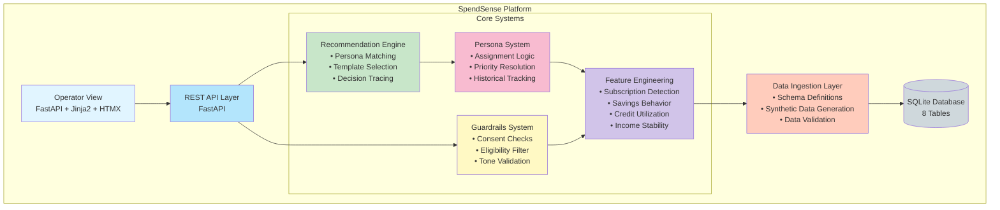

---

## Module Architecture

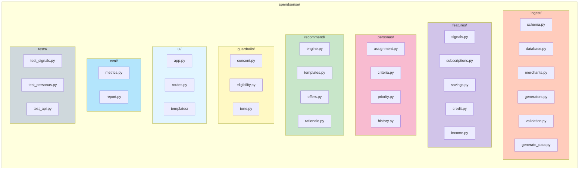

---

## Data Flow: Recommendation Generation

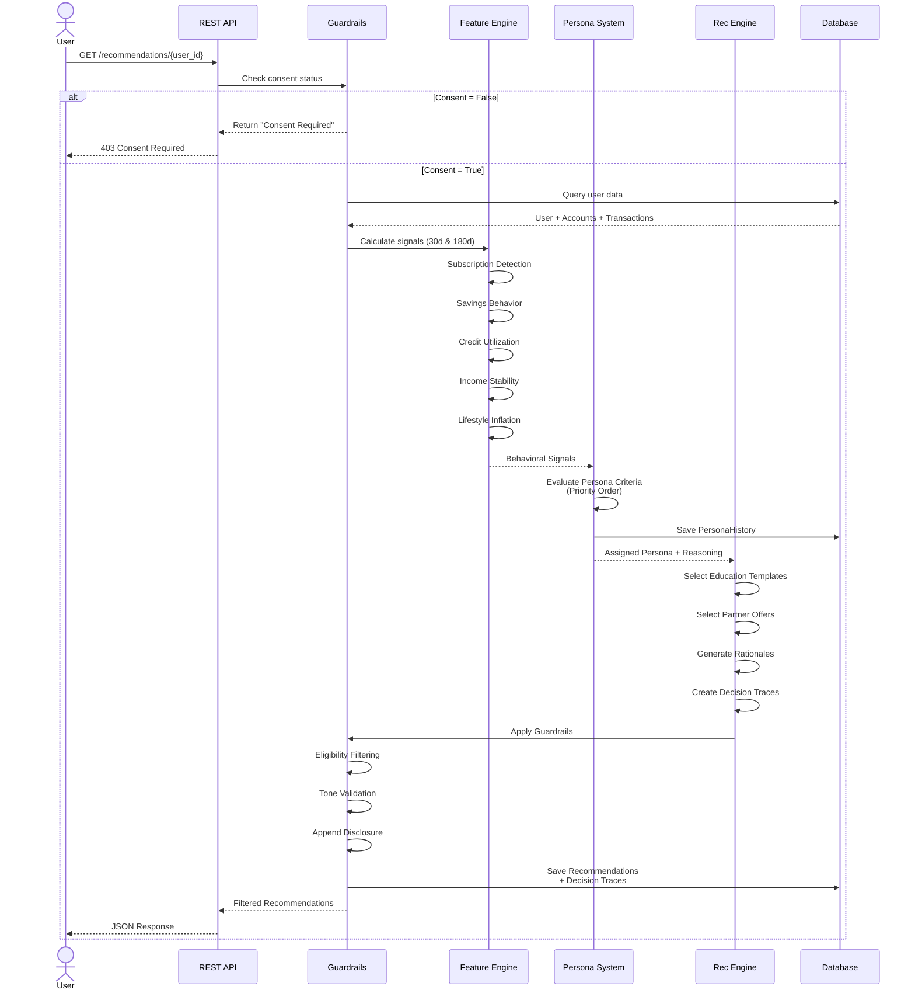

---

## Database Schema (Entity Relationship)

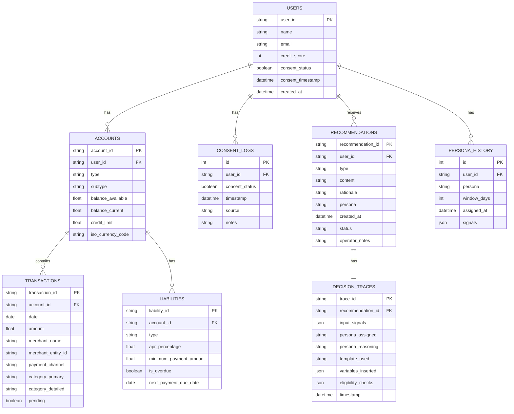

---

## Persona Assignment Decision Flow

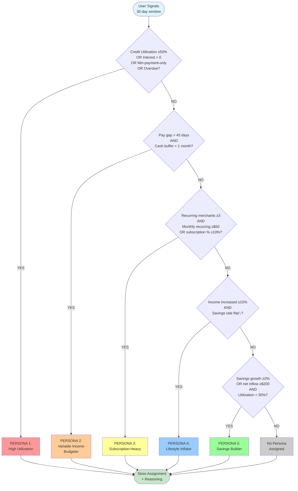

---

## Feature Engineering Pipeline

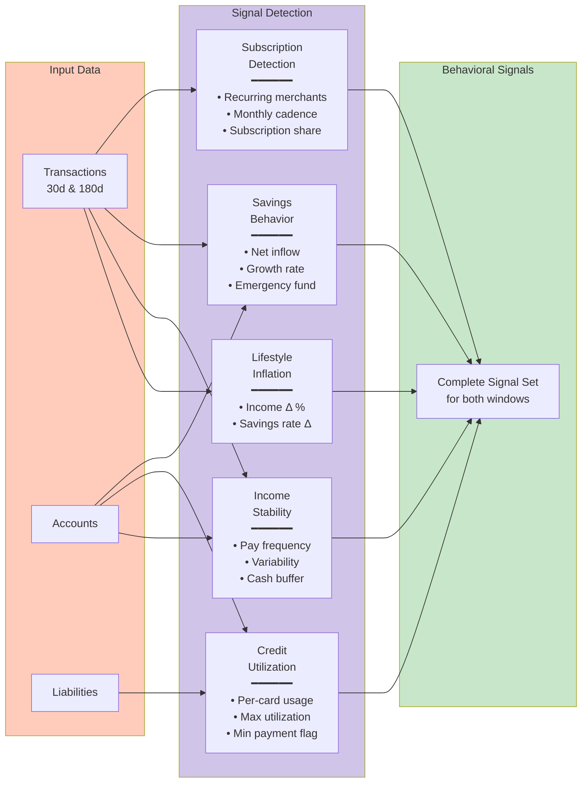

---

## API Architecture

```mermaid
graph TB
    subgraph "Public API"
        PE1[POST /users<br/>Create user]
        PE2[POST /consent<br/>Record consent]
        PE3[GET /profile/:id<br/>Get profile]
        PE4[GET /recommendations/:id<br/>Get recommendations]
        PE5[POST /feedback<br/>Submit feedback]
    end
    
    subgraph "Operator API"
        OE1[GET /operator/review<br/>Approval queue]
        OE2[GET /operator/user/:id<br/>Detailed view]
        OE3[POST /operator/approve/:id<br/>Approve recommendation]
        OE4[POST /operator/override/:id<br/>Override recommendation]
        OE5[POST /operator/flag/:id<br/>Flag for review]
    end
    
    subgraph "Business Logic"
        BL[Request Handlers]
    end
    
    subgraph "Data Layer"
        DB[(Database)]
    end
    
    PE1 --> BL
    PE2 --> BL
    PE3 --> BL
    PE4 --> BL
    PE5 --> BL
    OE1 --> BL
    OE2 --> BL
    OE3 --> BL
    OE4 --> BL
    OE5 --> BL
    
    BL --> DB
    
    style "Public API" fill:#e1f5ff
    style "Operator API" fill:#fff9c4
    style BL fill:#c8e6c9
    style DB fill:#cfd8dc
```

---

## Guardrails System

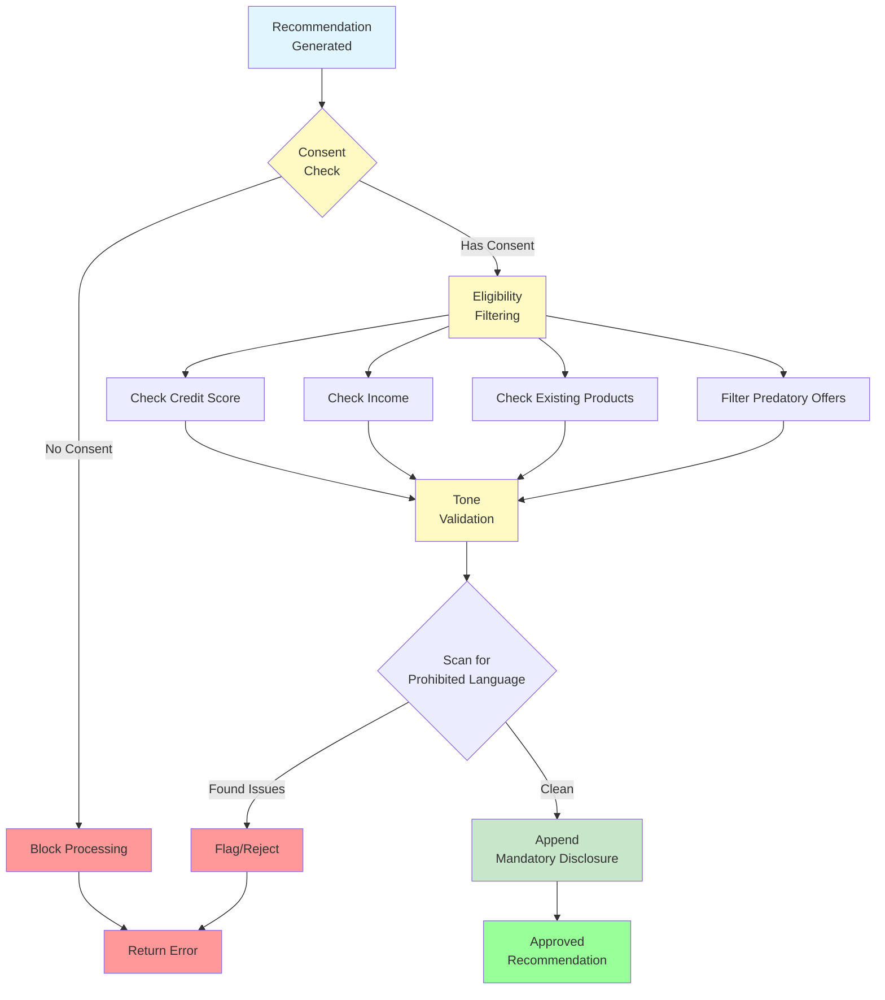

---

## Evaluation Metrics Dashboard

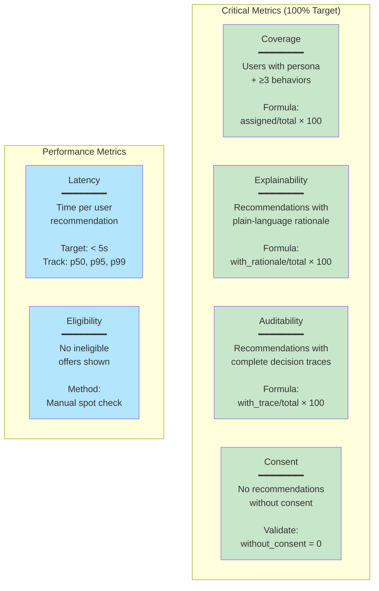

---

## Technology Stack

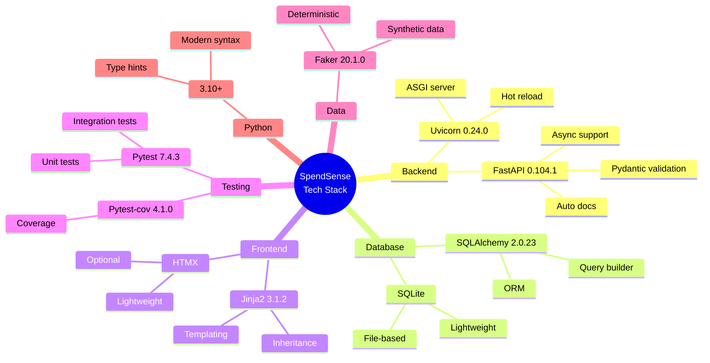

---

## Deployment States

```mermaid
graph LR
    subgraph "Current: Development"
        D1[Single FastAPI<br/>Instance]
        D2[(SQLite<br/>File-based)]
        D1 --> D2
    end
    
    subgraph "Future: Production"
        LB[Load Balancer]
        F1[FastAPI<br/>Instance 1]
        F2[FastAPI<br/>Instance 2]
        F3[FastAPI<br/>Instance N]
        DB[(PostgreSQL<br/>Replicated)]
        
        LB --> F1
        LB --> F2
        LB --> F3
        F1 --> DB
        F2 --> DB
        F3 --> DB
    end
    
    style "Current: Development" fill:#ffccbc
    style "Future: Production" fill:#c8e6c9
```

---

## User Journey: Recommendation Flow

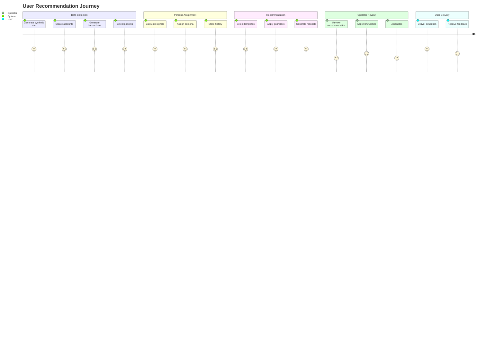

---

## State Transitions: Recommendation Lifecycle

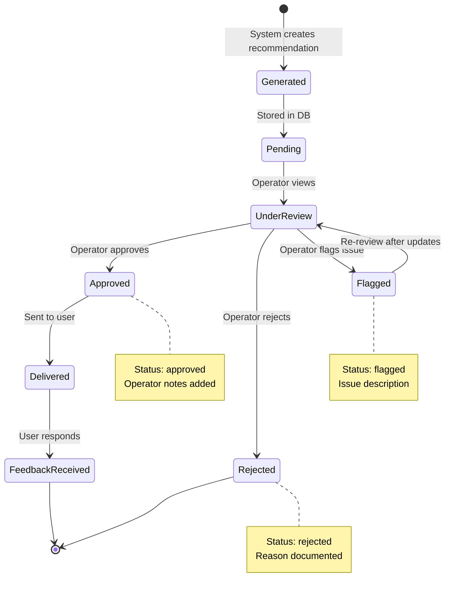

---

## Data Generation Process

```mermaid
flowchart TD
    Start([Start Data Generation]) --> Init[Initialize Database<br/>Create Tables & Indexes]
    Init --> UserGen[Generate Users<br/>50-100 synthetic profiles]
    
    UserGen --> U1[Create user record]
    U1 --> U2[Assign credit score<br/>300-850 range]
    U2 --> U3[Set consent status<br/>90% opt-in]
    U3 --> U4[Add consent log]
    
    U4 --> AcctGen[Generate Accounts<br/>Per User]
    
    AcctGen --> A1[Create checking<br/>Always included]
    A1 --> A2[Create savings<br/>60% probability]
    A2 --> A3[Create credit cards<br/>1-3 based on score]
    A3 --> A4[Create money market<br/>15% probability]
    A4 --> A5[Create HSA<br/>20% probability]
    
    A5 --> TxnGen[Generate Transactions<br/>3-6 months history]
    
    TxnGen --> T1[Income deposits<br/>Based on frequency]
    T1 --> T2[Subscription charges<br/>Monthly recurring]
    T2 --> T3[Regular spending<br/>Varied merchants]
    T3 --> T4[Savings transfers<br/>For savings accounts]
    
    T4 --> LiabGen[Generate Liabilities<br/>For credit cards]
    
    LiabGen --> L1[Calculate APR<br/>14-30%]
    L1 --> L2[Set minimum payment<br/>2.5% or $25]
    L2 --> L3[Determine overdue status<br/>10% if high util]
    
    L3 --> Validate[Validate Data<br/>Quality checks]
    
    Validate --> V1{Valid?}
    V1 -->|No| Error[Log errors<br/>Show warnings]
    V1 -->|Yes| Stats[Calculate Statistics<br/>Generate report]
    
    Stats --> End([Data Generation<br/>Complete])
    
    style Start fill:#e1f5ff
    style UserGen fill:#f8bbd0
    style AcctGen fill:#d1c4e9
    style TxnGen fill:#c8e6c9
    style LiabGen fill:#fff9c4
    style Validate fill:#ffccbc
    style End fill:#99ff99
    style Error fill:#ff9999
```

---

## Version History

- **v1.0** (2025-11-03): Initial Mermaid-based architecture
  - Complete Day 1: Data Foundation
  - All diagrams converted to Mermaid format
  - Interactive and renderable in markdown viewers
  - 75 users, 21K+ transactions generated

---

## How to View

These Mermaid diagrams will render automatically in:
- GitHub
- GitLab
- Markdown Preview Enhanced (VS Code)
- Obsidian
- Many other markdown viewers

For standalone rendering, visit: https://mermaid.live/

---

**Next Steps**: 
- Day 2: Feature Engineering
- Day 3: Persona System
- Day 4: Recommendation Engine
- Day 5: Guardrails & API
- Day 6: Operator View & Evaluation
- Day 7: Testing & Polish
